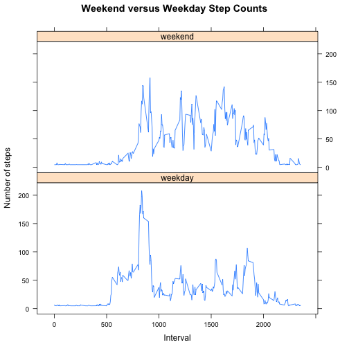

  
### Introduction  
This assignment makes use of data from a personal activity monitoring device. This device collects data at 5 minute intervals through out the day. The data consists of two months of data from an anonymous individual collected during the months of October and November, 2012 and include the number of steps taken in 5 minute intervals each day [[1][1]].
    
### Data  
The data for this assignment "activity.csv" can be downloaded from:  
Dataset: [Activity monitoring data][2] [52K]  
The data used in this assignment was downloaded on August 7, 2015 and had a file date of Feburary 11, 2014.  


### Load Libraries Needed by R to Conduct the Analysis

```r
# Load necessary libraries and explicitly set echo to TRUE.
library(data.table)
```

```
## data.table 1.9.4  For help type: ?data.table
## *** NB: by=.EACHI is now explicit. See README to restore previous behaviour.
```

```r
library(knitr)
        opts_chunk$set(echo = TRUE)
# Turn-off scientic notation in output
options(scipen = 1, digits = 0)
library(lattice)
```

### Loading and Preprocessing the Data
#### 1. Load the Data

```r
# Check to see if activity.csv exists in the current working directory
if ((!file.exists("./activity.csv"))) {
        stop("activity.csv file is missing - please download and unzip file to continue")
}
# Read in activity data
activity_data <- read.csv("activity.csv", header = TRUE)
```
#### 2. Preprocess Data to remove "NA" Results

```r
# Find the complete cases and subset the data
complete_cases_activity_data_index <- complete.cases(activity_data)
complete_cases_activity_data <- subset(activity_data,complete_cases_activity_data_index)
```

### What is Mean Total Number of Steps Taken per Day?
#### 1. Calculate the Total Number of Steps Taken per Day

```r
# Count the total number of steps take per day
total_number_of_steps_per_day <- aggregate(steps ~ date, complete_cases_activity_data, sum)
```
#### 2. Make a Histogram of the Total Number of Steps Taken Each Day

```r
# 1) Create a historgrm
hist(total_number_of_steps_per_day$steps, col = "red", xlab = "Number of Steps", main = "Total Number of Steps per Day")      
```

 

#### 3. Calculate and Report the Mean and Median of the Total Number of Steps Taken per Day  

```r
# Calculate the Mean and Median (note: Since the data was preprocessed to remove NA - na.rm=TRUE is not needed)
mean_number_of_steps <- mean(total_number_of_steps_per_day$steps)
median_number_of_steps <- median(total_number_of_steps_per_day$steps)
```
##### The mean of the total number of steps per day: 10766.  
##### The median of the total number of steps per day: 10765.  
   
### What is the Average Daily Activity Pattern?
#### 1. Make a time series plot (i.e. type = "l") of the 5-minute interval (x-axis) and the average number of steps taken, averaged across all days (y-axis)  

```r
# Split-out the step data by five minute intervals
complete_cases_activity_data_by_interval <- split(complete_cases_activity_data, complete_cases_activity_data$interval)
# Compute the average steps per interval
average_steps_per_interval <- sapply(complete_cases_activity_data_by_interval, function(x) mean(x$steps))
# Create a line plot of the average steps per interval
plot(average_steps_per_interval, type="l",  
     main="Average Steps Per Five Minute Interval Time Series Plot", 
     xlab="Five Minute Intervals", 
     ylab="Average Number of Steps") 
```

 
  
#### 2. Which 5-minute interval, on average across all the days in the dataset, contains the maximum number of steps?

```r
# Determine the interval with the highest number of steps
maximum_number_of_steps_interval <- names(which.max(average_steps_per_interval))
# Determine the maximum number of steps
maximum_number_of_steps <- max(average_steps_per_interval)  
```

##### The interval - 835 had the maximum of 206 number of steps.
### Imputing Missing Values
#### Note that there are a number of days/intervals where there are missing values (coded as NA). The presence of missing days may introduce bias into some calculations or summaries of the data.  
#### 1. Calculate and report the total number of missing values in the dataset (i.e. the total number of rows with NAs)

```r
# Compute the number of NAs
total_number_of_NAs <- sum(is.na(activity_data))  
```
  
##### The total number of NAs in the activity data is: 2304.  

#### 2. Devise a strategy for filling in all of the missing values in the dataset. The strategy does not need to be sophisticated. For example, you could use the mean/median for that day, or the mean for that 5-minute interval, etc.  

##### My strategy to fill-in the the missing values of the activity dataset is to use the mean value of the steps for that day  

#### 3. Create a new dataset that is equal to the original dataset but with the missing data filled in.  

```r
# Create a copy of the original activity data
imputed_activity_data <- activity_data
# Loop over the the data set replacing the NAs with the mean for that day
for (i in which(sapply(imputed_activity_data, is.numeric))) {
        imputed_activity_data[is.na(imputed_activity_data[,i]), i] <- mean(imputed_activity_data[, i], na.rm = TRUE)
}
```

#### 4. Make a histogram of the total number of steps taken each day and calculate and report the mean and median total number of steps taken per day. 

```r
imputed_total_number_of_steps_per_day <- aggregate(steps ~ date, imputed_activity_data, sum)
hist(imputed_total_number_of_steps_per_day$steps, col = "blue", xlab = "Number of Steps", main = "Imputed Total Number of Steps per Day")
```

 

```r
imputed_mean_number_of_steps <- mean(imputed_total_number_of_steps_per_day$steps)
imputed_median_number_of_steps <- median(imputed_total_number_of_steps_per_day$steps)
```

##### The mean of the imputed total number of steps per day: 10766.  
##### The median of the imputed total number of steps per day: 10766.  
  
##### Do these values differ from the estimates from the first part of the assignment? 
##### Yes - but not significantly - while the means are still the same - the imputed median is one step higher then complete case data set.  
##### What is the impact of imputing missing data on the estimates of the total daily number of steps?
##### The imputation had a very minor effect on the estimates of the total daily number of steps.

### Are There Differences in Activity Patterns Between Weekdays and Weekends?
#### For this part the weekdays() function may be of some help here. Use the dataset with the filled-in missing values for this part.  
#### 1. Create a new factor variable in the dataset with two levels – “weekday” and “weekend” indicating whether a given date is a weekday or weekend day.  

```r
# Convert the date column character class data to date class data
imputed_activity_data$date <- as.Date(strptime(imputed_activity_data$date, format="%Y-%m-%d")) 

# Add day_of_the_week factor to the imputed_activity_data
imputed_activity_data$day_of_the_week <- weekdays(imputed_activity_data$date) 

# Loop through the imputed_activity_data and assign the day_of_the_week
for (i in 1:nrow(imputed_activity_data)) {
        if (imputed_activity_data[i,]$day_of_the_week %in% c("Saturday","Sunday")) {
                imputed_activity_data[i,]$day_of_the_week<-"weekend"
        }
        else {
                imputed_activity_data[i,]$day_of_the_week<-"weekday"
        }
}
```

#### 2. Make a panel plot containing a time series plot (i.e. type = "l") of the 5-minute interval (x-axis) and the average number of steps taken, averaged across all weekday days or weekend days (y-axis). See the README file in the GitHub repository to see an example of what this plot should look like using simulated data.  


```r
# Aggregate the imputed_activity_data by steps as a function of interval and day_of_the_week  
weekday_vs_weekend_steps <- aggregate(imputed_activity_data$steps ~ imputed_activity_data$interval + imputed_activity_data$day_of_the_week, imputed_activity_data, mean)

# Rename columns
names(weekday_vs_weekend_steps) <- c("interval", "weekday_or_weekend", "steps")

# plot weekday over weekend time series  
xyplot(steps~interval|weekday_or_weekend, 
        data = weekday_vs_weekend_steps,
        type = "l",
        main = "Weekend versus Weekday Step Counts",
        xlab = "Interval",
        ylab = "Number of steps",
        layout=c(1,2))
```

 

##### The graphs show that more steps are taken on the weekend versus the weekday.

[1]: https://class.coursera.org/repdata-031/human_grading/view/courses/975144/assessments/3/submissions "1"
[2]: https://d396qusza40orc.cloudfront.net/repdata%2Fdata%2Factivity.zip "Activity monitoring data"
